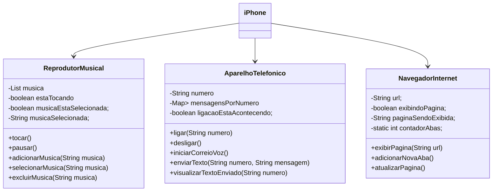

# 📱 Projeto: Modelo iPhone em Java

## Descrição

Este projeto é um desafio de Programação Orientada a Objetos (POO) proposto no bootcamp Santander Java 2025. O objetivo é modelar, diagramar e implementar em Java um sistema que simula as principais funcionalidades do primeiro iPhone apresentado por Steve Jobs em 2007. As funções modeladas abrangem um reprodutor musical, um aparelho telefônico e um navegador de internet, todos integrados em um menu simples.

## Contexto

O desafio partiu da análise da apresentação original do iPhone (assista [aqui](https://www.youtube.com/watch?v=9ou608QQRq8)), o que permitiu entender melhor as funcionalidades essenciais do aparelho. A partir disso, desenvolvi o diagrama UML das classes e interfaces utilizando a sintaxe Mermaid, e implementei todas as funcionalidades em Java.

## 📊 Diagrama UML das Classes

## Funcionalidades Modeladas

- **Reprodutor Musical:** tocar, pausar, selecionar, adicionar e excluir músicas.
- **Aparelho Telefônico:** ligar, desligar, iniciar correio de voz, enviar e visualizar mensagens de texto.
- **Navegador Internet:** exibir página, adicionar nova aba e atualizar página.

## Como Executar

Basta executar o menu localizado na classe `Main.java`. A partir do menu, é possível acessar todas as funcionalidades simuladas do iPhone. Certifique-se de ter o Java instalado em sua máquina.

## Requisitos

- Java (JDK 8 ou superior)
- IDE de sua preferência (Eclipse, IntelliJ, VSCode etc.) ou terminal

## 👨‍💻 Depoimento Pessoal

Gostei muito de assistir à apresentação que Steve Jobs fez do primeiro iPhone, e fiquei impressionado com o produto e o marketing feito, mesmo 20 anos depois. Quase quis comprar o produto. Após ter feito alguns projetos com Java, já estou me acostumando com a sintaxe e o paradigma de POO para implementar soluções, estou amando esse aprendizado.

---
### Contribuições

Aprecio muito qualquer feedback ou sugestão. Se você quiser modificar ou acrescentar algo, é só fazer um Pull Request!
